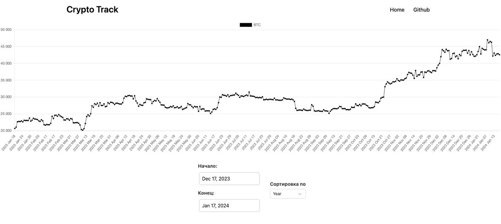

# Bitcoin Tracker



## Описание
Bitcoin Tracker – сервис для отслеживания текущей стоимости биткоина в реальном времени.

## Технологический стек
- **Nuxt3**: Мощный фреймворк для Vue.js, обеспечивающий быструю разработку и отличную производительность.
- **Typescript**: Строго типизированный язык программирования, повышающий надежность и читаемость кода.
- **Prisma**: Современный ORM
- **PostgreSQL**: база данных для хранения и управления данными.

## Docker и Docker Compose
Весь проект упакован в контейнеры с использованием Docker и управляется с помощью Docker Compose, что обеспечивает легкость развертывания и масштабируемость сервиса.

## Запуск проекта
Для запуска проекта необходимо иметь установленные Docker и Docker Compose. После этого можно выполнить следующие команды:
```
docker-compose build
docker-compose up
```